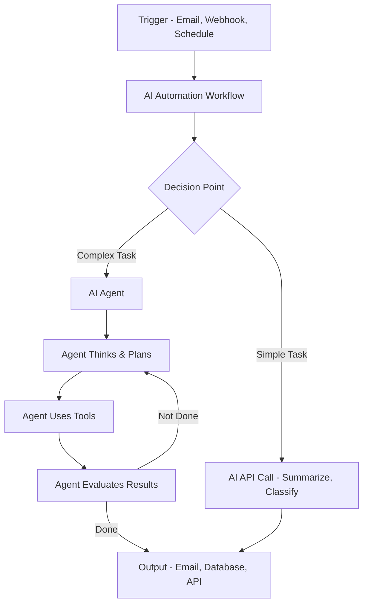
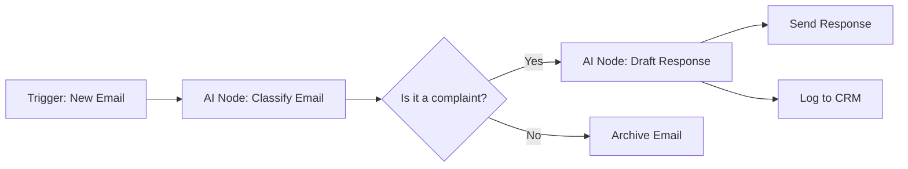
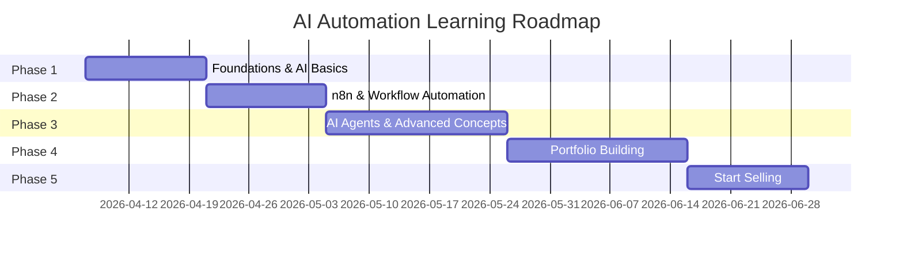

# 🚀 Zero-to-Hero Roadmap: Building & Selling AI Automations

> **Budget:** $0 — Every resource listed is free  
> **Goal:** Learn to build AI automations & workflows, then sell them as a service  
> **Your Background:** JavaScript/Node.js developer (this is a HUGE advantage)

---

## Table of Contents

1. [What Are AI Automations & AI Agents?](#1-what-are-ai-automations--ai-agents)
2. [The n8n Question — Is It Necessary?](#2-the-n8n-question--is-it-necessary)
3. [The Complete Tech Stack (All Free)](#3-the-complete-tech-stack-all-free)
4. [The Roadmap — 5 Phases](#4-the-roadmap--5-phases)
5. [Free Resources & Learning Materials](#5-free-resources--learning-materials)
6. [Portfolio Projects to Build](#6-portfolio-projects-to-build)
7. [How to Sell AI Automations](#7-how-to-sell-ai-automations)
8. [Common Mistakes to Avoid](#8-common-mistakes-to-avoid)

---

## 1. What Are AI Automations & AI Agents?

### AI Automation — The Simple Version

An **AI automation** is a workflow that uses AI (like ChatGPT, Claude, Gemini) to do tasks that normally require a human brain. Instead of just moving data from A to B (traditional automation), AI automations can **understand, decide, and create**.

**Traditional Automation Example:**
> "When I get an email, save the attachment to Google Drive"
> → No intelligence. Just moves a file.

**AI Automation Example:**
> "When I get an email, read it, determine if it's a customer complaint, extract the key issues, draft a professional response, and log it in our CRM"
> → Uses AI to understand, analyze, and create.

### AI Agents — The Next Level

An **AI Agent** is a more advanced concept. While an automation follows a **fixed workflow** (step 1 → step 2 → step 3), an agent can **think, plan, and decide its own steps**.

| Feature | AI Automation | AI Agent |
|---|---|---|
| **Flow** | Fixed, pre-defined steps | Dynamic, decides its own steps |
| **Decision Making** | Basic (if/else) | Complex reasoning |
| **Tools** | Uses tools you connect | Chooses which tools to use |
| **Memory** | Usually stateless | Can remember past interactions |
| **Example** | "Summarize every email" | "Research this topic, find sources, write a report, and email it to me" |

### How They Work Together — The Architecture



### Key Concepts You Need to Understand

| Concept | What It Is | Example |
|---|---|---|
| **LLM (Large Language Model)** | The AI brain (GPT-4, Claude, Gemini, Llama) | ChatGPT is powered by GPT-4 |
| **Prompt Engineering** | Writing instructions for the AI | "You are a customer support agent. Respond professionally..." |
| **API** | How your code talks to AI services | Sending a request to OpenAI's API |
| **RAG (Retrieval Augmented Generation)** | Giving the AI your own data to reference | "Answer questions using our company's FAQ document" |
| **Vector Database** | Stores data in a way AI can search intelligently | Pinecone, Chroma, Qdrant |
| **Function Calling / Tool Use** | Letting the AI call your code | AI decides to search Google, then summarize results |
| **Webhook** | A URL that receives data when an event happens | Stripe sends payment data to your webhook |
| **Workflow Orchestration** | Managing multi-step processes | n8n, Langchain, custom Node.js code |

---

## 2. The n8n Question — Is It Necessary?

### Short Answer: **No, but it's extremely valuable. Use it.**

### What is n8n?

n8n is an **open-source, self-hostable workflow automation platform**. Think of it as a visual programming tool where you connect "nodes" (blocks) together to create automations.



### Why n8n is Valuable (Even Though Not "Necessary")

| Reason | Explanation |
|---|---|
| ✅ **Free & Open Source** | Self-host it for $0. No subscription fees. |
| ✅ **Visual Builder** | Drag-and-drop interface. See your workflow visually. |
| ✅ **400+ Integrations** | Gmail, Slack, Notion, Google Sheets, databases, and more — pre-built. |
| ✅ **Built-in AI Nodes** | Native nodes for OpenAI, Anthropic, Google AI, Ollama (local AI). |
| ✅ **AI Agent Node** | A dedicated node that turns your workflow into an AI agent with tools. |
| ✅ **Code Nodes** | You can write JavaScript/Python inside n8n when you need custom logic. |
| ✅ **Clients Love It** | Clients can SEE the workflow visually. It builds trust and looks professional. |
| ✅ **Speed** | Build in hours what would take days in pure code. |
| ✅ **Community** | Massive community, tons of templates, active Discord. |

### Why n8n is NOT "Necessary"

| Reason | Explanation |
|---|---|
| 🔶 **You know JavaScript** | You CAN build everything with pure Node.js code. |
| 🔶 **More control with code** | Custom code gives you unlimited flexibility. |
| 🔶 **Learning the fundamentals matters more** | Understanding APIs, prompts, and architecture > knowing any tool. |
| 🔶 **Some projects don't need it** | A simple chatbot doesn't need a workflow platform. |

### The Verdict — Use BOTH

> [!IMPORTANT]
> **The winning strategy is: Learn BOTH n8n AND code-based approaches.**
> - Use **n8n** for: Client projects, rapid prototyping, integrations-heavy workflows
> - Use **code** (Node.js/Python) for: Custom AI agents, complex logic, SaaS products
> - Most successful AI automation freelancers use n8n for 70% of their work and custom code for 30%

### n8n vs Alternatives Comparison

| Tool | Cost | Open Source | AI Features | Best For |
|---|---|---|---|---|
| **n8n** | Free (self-hosted) | ✅ Yes | Excellent | AI workflows + integrations |
| **Langchain** | Free | ✅ Yes | Excellent | Code-based AI agents |
| **CrewAI** | Free | ✅ Yes | Excellent | Multi-agent systems |
| **Flowise** | Free (self-hosted) | ✅ Yes | Good | No-code AI chains |
| **Make.com** | Freemium | ❌ No | Good | Simple automations |
| **Zapier** | Freemium | ❌ No | Basic | Very simple automations |

---

## 3. The Complete Tech Stack (All Free)

### Your Free Toolkit

```
┌─────────────────────────────────────────────────┐
│                 YOUR AI STACK                    │
├─────────────────────────────────────────────────┤
│                                                 │
│  🧠 AI Models (Free Tiers)                      │
│  ├── Google Gemini API (free tier — generous)   │
│  ├── Groq (free tier — fast inference)          │
│  ├── OpenRouter (free models available)         │
│  ├── Ollama (run models locally — 100% free)    │
│  └── HuggingFace (free inference API)           │
│                                                 │
│  🔧 Automation & Workflow                        │
│  ├── n8n (self-hosted, open source)             │
│  ├── Node.js (your main programming language)   │
│  └── Flowise (visual AI chain builder)          │
│                                                 │
│  🤖 AI Agent Frameworks                          │
│  ├── LangChain.js (JavaScript)                  │
│  ├── CrewAI (Python — worth learning)           │
│  └── Autogen (Microsoft, Python)                │
│                                                 │
│  💾 Databases (Free Tiers)                       │
│  ├── Supabase (PostgreSQL + Vector search)      │
│  ├── ChromaDB (local vector database)           │
│  └── SQLite (local, zero-config)                │
│                                                 │
│  🏠 Hosting (Free Tiers)                         │
│  ├── Railway.app (free tier for n8n)            │
│  ├── Render.com (free tier)                     │
│  ├── Vercel (free tier for frontends)           │
│  └── Your own PC with Docker                    │
│                                                 │
│  📚 Version Control                              │
│  └── GitHub (you already use this ✅)            │
│                                                 │
└─────────────────────────────────────────────────┘
```

### Free AI API Access — Detailed Breakdown

| Provider | Free Tier | Rate Limits | Best For |
|---|---|---|---|
| **Google Gemini** | 15 RPM, 1M tokens/day (Gemini Flash) | Generous | General purpose, vision, long context |
| **Groq** | 30 RPM on Llama models | Good for prototyping | Fast inference, testing |
| **Ollama (Local)** | Unlimited (runs on your PC) | Limited by your hardware | Privacy, offline work, learning |
| **HuggingFace** | Free inference API | Rate limited | Specialized models |
| **OpenRouter** | Some free models | Varies | Model variety |
| **Cloudflare Workers AI** | 10,000 neurons/day free | Good | Edge AI, serverless |

> [!TIP]
> **Start with Google Gemini API** — it has the most generous free tier and excellent capabilities. Use **Ollama** for offline learning and unlimited practice. Both are completely free.

---

## 4. The Roadmap — 5 Phases

### Overview Timeline



---

### 📘 Phase 1: Foundations (Weeks 1-2)

**Goal:** Understand AI, APIs, and prompt engineering

#### Week 1: AI & LLM Fundamentals

- [ ] **Day 1-2: Understand LLMs**
  - Watch: [3Blue1Brown — "But what is a GPT?"](https://www.youtube.com/watch?v=wjZofJX0v4M) (free)
  - Watch: [Andrej Karpathy — "Intro to LLMs"](https://www.youtube.com/watch?v=zjkBMFhNj_g) (free, 1 hour)
  - Understand: tokens, context windows, temperature, system prompts
  
- [ ] **Day 3-4: Prompt Engineering**
  - Read: [Google's Prompt Engineering Guide](https://ai.google.dev/docs/prompt_best_practices) (free)
  - Read: [OpenAI's Prompt Engineering Guide](https://platform.openai.com/docs/guides/prompt-engineering) (free)
  - Practice: Use ChatGPT/Gemini free tiers to practice structured prompts
  - Learn: System prompts, few-shot prompting, chain-of-thought, output formatting

- [ ] **Day 5-7: AI APIs — Your First Integration**
  - Get a free Google Gemini API key from [Google AI Studio](https://aistudio.google.com/)
  - Build your first AI-powered Node.js script:

  ```javascript
  // Your first AI automation — a simple email classifier
  import { GoogleGenerativeAI } from "@google/generative-ai";
  
  const genAI = new GoogleGenerativeAI("YOUR_FREE_API_KEY");
  const model = genAI.getGenerativeModel({ model: "gemini-2.0-flash" });
  
  async function classifyEmail(emailText) {
    const prompt = `Classify this email into one of: 
    [complaint, inquiry, spam, order, feedback]
    
    Email: "${emailText}"
    
    Respond with JSON: { "category": "...", "priority": "high/medium/low", "summary": "..." }`;
    
    const result = await model.generateContent(prompt);
    return JSON.parse(result.response.text());
  }
  ```

#### Week 2: APIs, Webhooks & Integration Basics

- [ ] **Day 8-9: REST APIs Deep Dive**
  - You already know JavaScript — now learn how APIs work in the automation context
  - Practice: Call Google Gemini, Notion API, Google Sheets API
  - Understand: Authentication (API keys, OAuth), rate limiting, error handling

- [ ] **Day 10-11: Webhooks**
  - Understand: How webhooks trigger automations
  - Build: A simple webhook receiver in Node.js + Express
  - Practice: Use [webhook.site](https://webhook.site) to test

- [ ] **Day 12-14: JSON, Data Transformation & Parsing**
  - Master: Extracting data from AI responses (JSON mode, structured output)
  - Practice: Transform data between different API formats
  - Learn: How to handle AI "hallucinations" and validate outputs

> [!NOTE]
> **Why this phase matters:** Everything in AI automation is built on APIs and prompts. If you skip this, n8n and every other tool will confuse you. Master the fundamentals first.

---

### 📗 Phase 2: n8n & Workflow Automation (Weeks 3-4)

**Goal:** Master n8n and build real workflows

#### Week 3: n8n Setup & Basics

- [ ] **Day 1-2: Install n8n**
  - Option A (Recommended): Install via npm — `npx n8n` (runs locally, free)
  - Option B: Use Docker — `docker run -it --rm --name n8n -p 5678:5678 n8nio/n8n`
  - Option C: [n8n.cloud](https://n8n.cloud) free trial (limited but easy)
  - Explore the interface, understand nodes, connections, and executions

- [ ] **Day 3-4: Core n8n Nodes**
  - Learn these essential nodes:

  | Node | What It Does |
  |---|---|
  | **Webhook** | Receives incoming data (trigger) |
  | **Schedule Trigger** | Runs workflow on a timer |
  | **HTTP Request** | Calls any API |
  | **Code** | Write custom JavaScript |
  | **IF** | Conditional branching |
  | **Switch** | Multi-path branching |
  | **Merge** | Combine data from multiple paths |
  | **Set** | Transform/set data fields |
  | **Gmail/Google Sheets/Notion** | Popular integrations |

- [ ] **Day 5-7: Build 3 Basic Workflows**
  1. **RSS → AI Summary → Email**: Fetch news, summarize with AI, email yourself
  2. **Form → AI Classification → Google Sheet**: Classify form submissions
  3. **Schedule → API → Notification**: Daily weather/crypto/news briefing

#### Week 4: n8n AI Features

- [ ] **Day 8-10: n8n AI Nodes**
  - Learn the AI-specific nodes:

  | Node | What It Does |
  |---|---|
  | **AI Agent** | Creates an autonomous agent with tools |
  | **Chat Model** | Connects to LLMs (OpenAI, Gemini, Ollama) |
  | **Text Classifier** | Classifies text into categories |
  | **Sentiment Analysis** | Analyzes tone/sentiment |
  | **Summarization Chain** | Summarizes documents |
  | **Vector Store** | Stores/retrieves embeddings |
  | **Document Loader** | Loads PDFs, web pages, etc. |
  | **Memory** | Gives agents conversation memory |

- [ ] **Day 11-12: Build an AI Agent in n8n**
  - Create an agent that can:
    - Search the web
    - Read documents
    - Answer questions about your data
    - Take actions (send emails, update spreadsheets)

- [ ] **Day 13-14: RAG (Retrieval Augmented Generation) in n8n**
  - Load a PDF into a vector store
  - Build a "Chat with your documents" workflow
  - Understand: Embeddings, chunking, similarity search

> [!TIP]
> **n8n Learning Resources (All Free):**
> - [n8n Official Docs](https://docs.n8n.io/) — Excellent documentation
> - [n8n YouTube Channel](https://www.youtube.com/@n8n-io) — Tutorials and walkthroughs
> - [n8n Community](https://community.n8n.io/) — Ask questions, find templates
> - [n8n Workflow Templates](https://n8n.io/workflows/) — Copy and modify existing workflows

---

### 📙 Phase 3: AI Agents & Advanced Concepts (Weeks 5-7)

**Goal:** Build sophisticated AI agents and understand advanced patterns

#### Week 5: AI Agent Frameworks

- [ ] **Day 1-3: LangChain.js**
  - Why: The most popular AI agent framework, very well documented
  - Install: `npm install langchain @langchain/community`
  - Learn:
    - Chains (sequential AI calls)
    - Agents (AI that decides what to do)
    - Tools (functions the agent can call)
    - Memory (conversational context)
  - Resource: [LangChain.js Docs](https://js.langchain.com/docs/) (free)

  ```javascript
  // Simple LangChain.js agent example
  import { ChatGoogleGenerativeAI } from "@langchain/google-genai";
  import { AgentExecutor, createToolCallingAgent } from "langchain/agents";
  import { Calculator } from "@langchain/community/tools/calculator";
  
  const model = new ChatGoogleGenerativeAI({ model: "gemini-2.0-flash" });
  const tools = [new Calculator()];
  // Agent can now do math, search, and more
  ```

- [ ] **Day 4-5: Understanding Agent Patterns**

  | Pattern | Description | Use Case |
  |---|---|---|
  | **ReAct** | Reason + Act loop | General purpose agents |
  | **Plan & Execute** | Plan steps, then execute | Complex multi-step tasks |
  | **Tool Use** | AI calls functions/APIs | External integrations |
  | **Multi-Agent** | Multiple specialized agents collaborate | Complex workflows |
  | **RAG Agent** | Agent with knowledge base access | Q&A over documents |

- [ ] **Day 6-7: Build a Custom Agent**
  - Build a Node.js agent that can:
    - Search the web (using free Serper or DuckDuckGo API)
    - Read web pages
    - Summarize findings
    - Write reports

#### Week 6: RAG & Vector Databases

- [ ] **Day 8-10: Deep Dive into RAG**
  - Understand the full RAG pipeline:

  ```mermaid
  graph LR
      A[Documents] --> B[Chunk Text]
      B --> C[Generate Embeddings]
      C --> D[Store in Vector DB]
      E[User Query] --> F[Generate Query Embedding]
      F --> G[Search Vector DB]
      G --> H[Retrieve Relevant Chunks]
      H --> I[Send to LLM with Context]
      I --> J[AI Response with Sources]
  ```

  - Tools to learn:
    - **ChromaDB** (local, free, easy to start)
    - **Supabase Vector** (free tier, PostgreSQL-based)
  - Build: A "Chat with your codebase" tool using your own GitHub repos

- [ ] **Day 11-14: Advanced Techniques**
  - **Structured Output**: Force AI to return specific JSON schemas
  - **Function Calling**: Let AI decide which functions to execute
  - **Streaming**: Stream AI responses for better UX
  - **Error Handling**: Retry logic, fallback models, input validation
  - **Prompt Chaining**: Break complex tasks into multiple AI calls

#### Week 7: Multi-Agent Systems & CrewAI

- [ ] **Day 15-17: Multi-Agent Concepts**
  - Understand: Why multiple specialized agents > one general agent
  - Example: Content creation pipeline

  ```mermaid
  graph TD
      A[Manager Agent] --> B[Research Agent]
      A --> C[Writer Agent]
      A --> D[Editor Agent]
      B --> E[Searches web, gathers facts]
      C --> F[Writes draft from research]
      D --> G[Reviews and improves draft]
      G --> H[Final Content]
  ```

- [ ] **Day 18-21: Learn CrewAI (Python)**
  - Why Python? CrewAI is Python-only, and it's the #1 multi-agent framework
  - Basic Python is enough — you already know programming concepts
  - Resource: [CrewAI Docs](https://docs.crewai.com/) (free)
  - Build: A research crew that researches a topic and writes a blog post

> [!IMPORTANT]
> **Python for AI:** While your main skill is JavaScript, learning basic Python is almost mandatory for AI work. Many AI tools are Python-first. You don't need to be an expert — just enough to use frameworks. Budget 3-4 days to learn Python basics if needed. Use [Python.org Tutorial](https://docs.python.org/3/tutorial/) (free).

---

### 📕 Phase 4: Portfolio Building (Weeks 8-10)

**Goal:** Build 5 portfolio projects that demonstrate your skills to potential clients

#### Project 1: AI Customer Support Bot
- **Stack:** n8n + Gemini API + Supabase
- **What it does:**
  - Receives customer messages via webhook
  - Searches knowledge base (RAG) for relevant answers
  - Generates professional responses
  - Escalates complex issues to humans
  - Logs all interactions
- **Why clients want this:** Reduces support costs by 50-80%

#### Project 2: Content Creation Pipeline
- **Stack:** n8n + LangChain.js + WordPress API
- **What it does:**
  - Takes a topic/keyword as input
  - Researches the topic (web search)
  - Generates SEO-optimized blog post
  - Creates social media posts (Twitter, LinkedIn)
  - Publishes to WordPress automatically
- **Why clients want this:** Saves 5-10 hours per blog post

#### Project 3: Lead Qualification & CRM Automation
- **Stack:** n8n + Gemini + Google Sheets (or free CRM)
- **What it does:**
  - Receives new lead from form/email
  - AI analyzes and scores the lead
  - Categorizes by interest/budget/urgency
  - Sends personalized follow-up email
  - Updates CRM/spreadsheet
- **Why clients want this:** Sales teams waste 60% of time on unqualified leads

#### Project 4: Document Processing & Analysis
- **Stack:** Node.js + LangChain.js + ChromaDB
- **What it does:**
  - Upload PDFs, contracts, invoices
  - AI extracts key information
  - Summarizes documents
  - Answers questions about the documents
  - Generates reports
- **Why clients want this:** Lawyers, accountants, and businesses process hundreds of documents

#### Project 5: Multi-Agent Research Assistant
- **Stack:** CrewAI or LangChain.js
- **What it does:**
  - Takes a research question
  - Multiple agents collaborate:
    - Researcher finds sources
    - Analyst evaluates credibility
    - Writer creates a structured report
  - Outputs a comprehensive research document
- **Why clients want this:** Market research, competitive analysis, due diligence

> [!TIP]
> **For each project, create:**
> - A GitHub repo with clean README
> - A 2-3 minute demo video (use free screen recorder like OBS)
> - A one-page case study: Problem → Solution → Results
> - Deploy a working demo if possible (use free hosting tiers)

---

### 📓 Phase 5: Start Selling (Weeks 11-12)

**Goal:** Land your first paying client

#### Where to Find Clients (All Free to Join)

| Platform | Type | How to Use |
|---|---|---|
| **Upwork** | Freelancing | Search "AI automation", "n8n", "workflow automation" |
| **Fiverr** | Gig-based | Create gigs: "I will build AI automations with n8n" |
| **Twitter/X** | Social selling | Share your builds, engage with AI community |
| **LinkedIn** | Professional network | Post about AI automation, connect with business owners |
| **Reddit** | Communities | r/n8n, r/automation, r/artificial, r/ChatGPT |
| **Discord** | Communities | n8n Discord, AI automation servers |
| **Local businesses** | Direct outreach | Email/visit local businesses with specific solutions |
| **IndieHackers** | Startup community | Connect with founders who need automation |

#### Pricing Guide (Starting Out)

| Service | Beginner Price | Experienced Price |
|---|---|---|
| Simple automation (1-3 steps) | $100-300 | $500-1,000 |
| Medium automation (multi-step + AI) | $300-800 | $1,000-3,000 |
| Complex AI agent system | $800-2,000 | $3,000-10,000 |
| Monthly retainer (maintenance) | $200-500/mo | $1,000-3,000/mo |
| "Chat with your data" bot | $500-1,500 | $2,000-5,000 |

#### How to Pitch AI Automation to Businesses

**Don't say:** "I build AI automations with n8n and LangChain"  
**Do say:** "I help businesses save 20+ hours per week by automating repetitive tasks with AI"

**The Pitch Framework:**
1. **Identify their pain:** "How much time does your team spend on [manual task]?"
2. **Quantify the cost:** "That's roughly $X,000/month in labor"
3. **Show the solution:** Demo your portfolio project
4. **Make it risk-free:** "I'll build a proof of concept first. If it doesn't save you time, you don't pay"

---

## 5. Free Resources & Learning Materials

### Video Courses (Free)

| Resource | What You'll Learn | Link |
|---|---|---|
| **n8n YouTube Channel** | n8n basics to advanced AI workflows | [youtube.com/@n8n-io](https://youtube.com/@n8n-io) |
| **Leon van Zyl** | n8n AI automations, practical builds | [YouTube](https://youtube.com/@leonvanzyl) |
| **Cole Medin** | AI agents, n8n, LangChain tutorials | [YouTube](https://youtube.com/@ColeMedin) |
| **FreeCodeCamp AI courses** | Various AI & ML fundamentals | [youtube.com/@freecodecamp](https://youtube.com/@freecodecamp) |
| **Andrej Karpathy** | Deep understanding of LLMs | [YouTube](https://youtube.com/@AndrejKarpathy) |
| **Matt Williams (Ollama)** | Running AI locally | [YouTube](https://youtube.com/@technovangelist) |

### Documentation (Free)

| Resource | Link |
|---|---|
| n8n Docs | [docs.n8n.io](https://docs.n8n.io) |
| LangChain.js | [js.langchain.com](https://js.langchain.com) |
| Google Gemini API | [ai.google.dev](https://ai.google.dev) |
| CrewAI | [docs.crewai.com](https://docs.crewai.com) |
| Ollama | [ollama.com](https://ollama.com) |
| Supabase | [supabase.com/docs](https://supabase.com/docs) |

### Communities (Free)

| Community | Platform |
|---|---|
| n8n Community | [community.n8n.io](https://community.n8n.io) |
| r/n8n | Reddit |
| r/LocalLLaMA | Reddit (for local AI models) |
| LangChain Discord | Discord |
| n8n Discord | Discord |
| AI Automation Twitter/X | Follow: @naborsky, @nocodelyft |

---

## 6. High-Demand Automations to Learn

These are the automations businesses are actively paying for in 2026:

| Automation | Demand Level | Difficulty | Typical Price |
|---|---|---|---|
| AI Email Management | 🔥🔥🔥🔥🔥 | Medium | $500-2,000 |
| Lead Qualification Bots | 🔥🔥🔥🔥🔥 | Medium | $800-3,000 |
| Customer Support Chatbots | 🔥🔥🔥🔥 | Medium-Hard | $1,000-5,000 |
| Content Generation Pipelines | 🔥🔥🔥🔥 | Medium | $500-2,000 |
| Document Processing (PDF→Data) | 🔥🔥🔥🔥 | Hard | $1,500-5,000 |
| Social Media Automation | 🔥🔥🔥 | Easy-Medium | $300-1,500 |
| Meeting Note Summarization | 🔥🔥🔥 | Easy | $200-800 |
| CRM Data Enrichment | 🔥🔥🔥 | Medium | $500-2,000 |
| Code Review Automation | 🔥🔥 | Hard | $2,000-5,000 |
| Multi-Agent Research Systems | 🔥🔥 | Hard | $3,000-10,000 |

---

## 7. Your Learning Schedule (Suggested)

### Daily Schedule (2-3 hours/day)

| Time Block | Activity |
|---|---|
| **30 min** | Watch tutorial / read documentation |
| **90 min** | Hands-on building / coding |
| **30 min** | Community engagement (Reddit, Discord, Twitter) |

### Weekly Milestones

| Week | Milestone |
|---|---|
| 1 | ✅ Understand LLMs, make first API call, build email classifier |
| 2 | ✅ Master webhooks, build 2 Node.js AI scripts |
| 3 | ✅ n8n installed, 3 basic workflows built |
| 4 | ✅ n8n AI nodes mastered, RAG workflow built |
| 5 | ✅ LangChain.js agent built, understand agent patterns |
| 6 | ✅ Vector DB setup, RAG pipeline built |
| 7 | ✅ Multi-agent system built (CrewAI or LangChain) |
| 8 | ✅ Portfolio Project 1 & 2 complete |
| 9 | ✅ Portfolio Project 3 & 4 complete |
| 10 | ✅ Portfolio Project 5 complete, all demos recorded |
| 11 | ✅ Upwork/Fiverr profiles created, first proposals sent |
| 12 | ✅ First client project started 🎉 |

---

## 8. Common Mistakes to Avoid

> [!CAUTION]
> ### Mistakes That Will Waste Your Time
> 
> 1. **Trying to learn everything at once** — Follow the phases in order
> 2. **Skipping fundamentals for tools** — Understanding APIs & prompts > knowing n8n buttons
> 3. **Not building projects** — Reading without building teaches you nothing
> 4. **Perfectionism** — Ship imperfect projects. Iterate later.
> 5. **Ignoring prompt engineering** — 80% of AI automation quality comes from good prompts
> 6. **Only using no-code** — Clients pay MORE for custom code solutions
> 7. **Not engaging with communities** — Your network = your net worth in freelancing
> 8. **Underpricing** — Don't charge $50 for something worth $500. Research market rates.
> 9. **Building what YOU think is cool vs what clients NEED** — Focus on business problems
> 10. **Waiting until you're "ready"** — Start selling at 70% knowledge. You'll learn the rest on the job.

---

## Quick-Start Checklist (Do This Today)

- [ ] Get a free [Google Gemini API key](https://aistudio.google.com/)
- [ ] Install [Ollama](https://ollama.com) for local AI (optional but recommended)
- [ ] Watch [Andrej Karpathy's LLM intro](https://www.youtube.com/watch?v=zjkBMFhNj_g)
- [ ] Run `npx n8n` to start n8n locally
- [ ] Join the [n8n Community](https://community.n8n.io/)
- [ ] Follow AI automation creators on YouTube (Leon van Zyl, Cole Medin)
- [ ] Write your first AI API call in Node.js

---

> **Remember:** You already know JavaScript and Node.js. That puts you ahead of 80% of people trying to get into AI automation. Most "AI automation experts" only know no-code tools. You can do both — that's your competitive advantage. 💪
